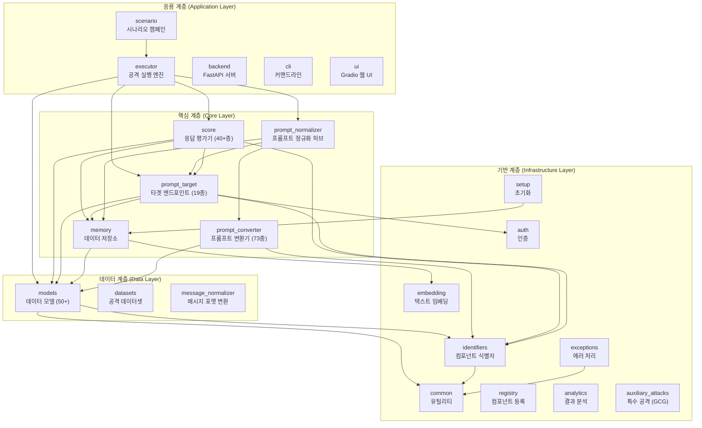
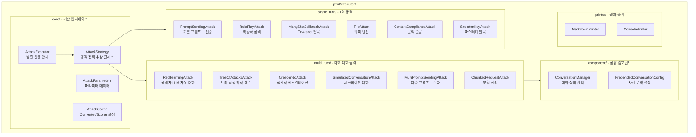
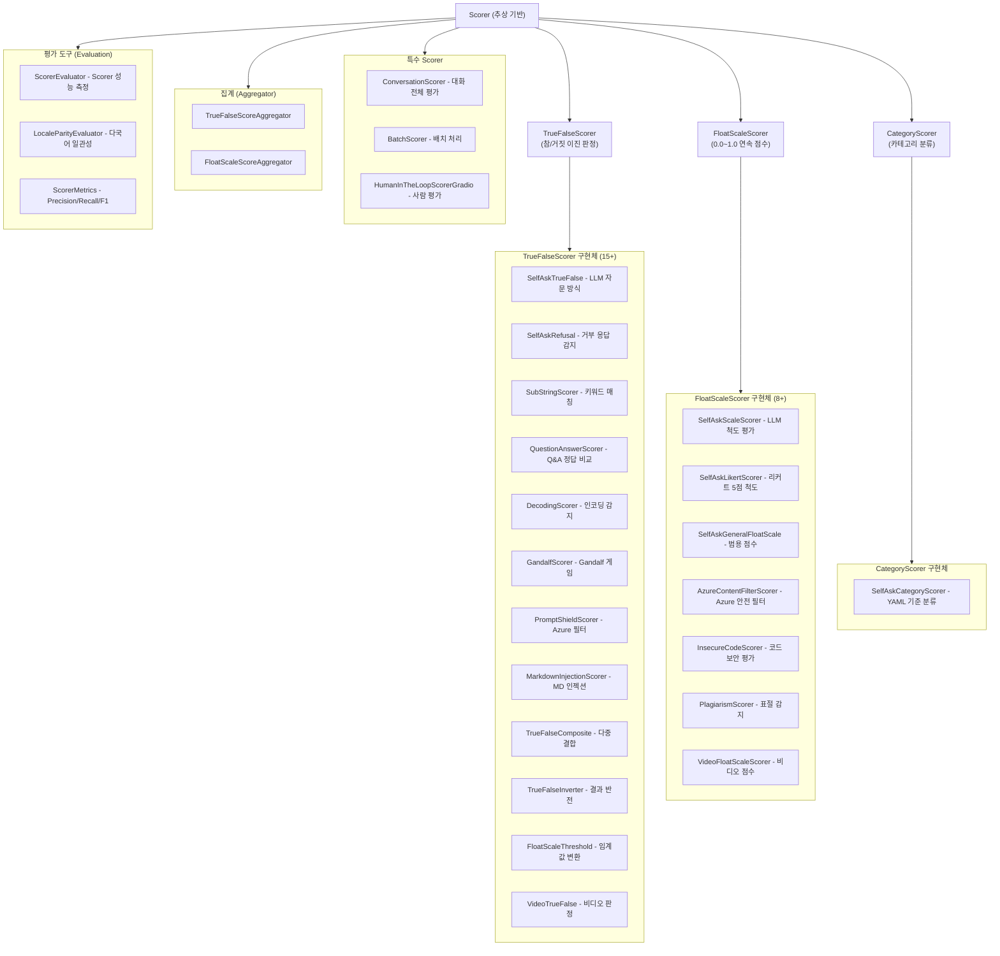
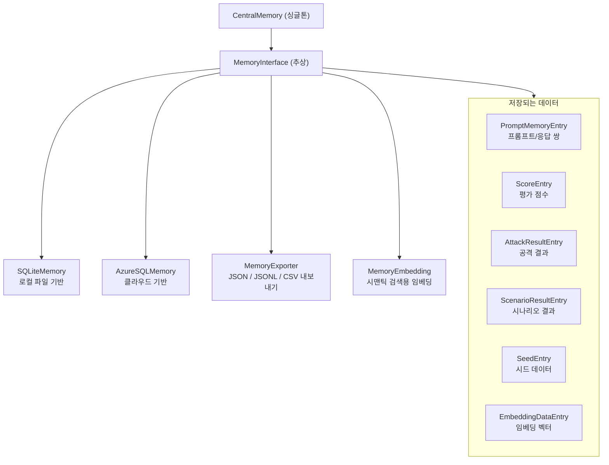
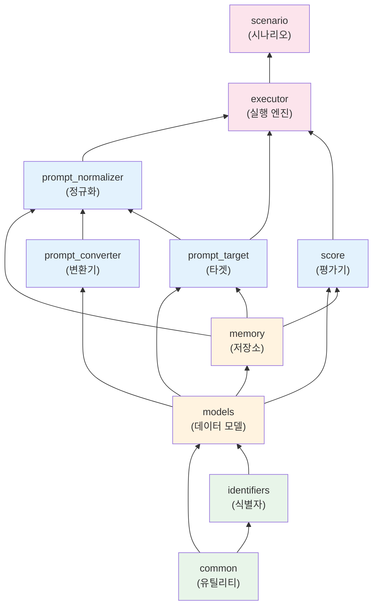
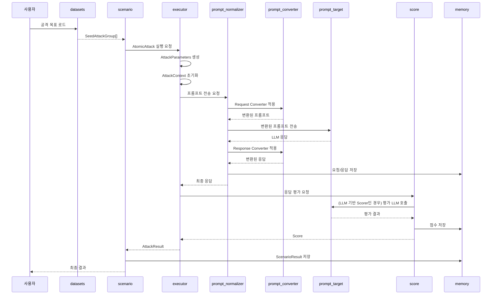
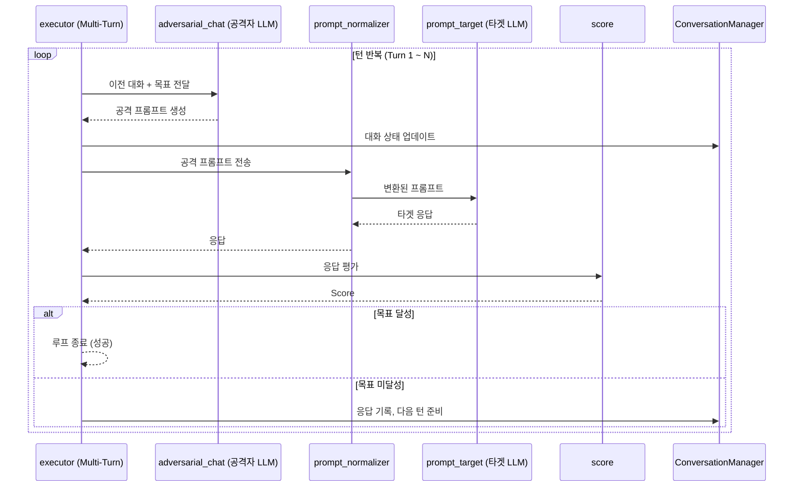

# PyRIT_ko 모듈별 기능 정리 및 상관관계

> `pyrit/` 내 모든 모듈의 역할, 주요 클래스, 모듈 간 의존 관계를 정리한 문서

---

## 1. 모듈 전체 구조 (한눈에 보기)

---

## 2. 모듈별 상세 기능 표

### 2.1 응용 계층 (Application Layer)

| 모듈 | 위치 | 역할 | 주요 클래스 | 의존 모듈 |
|:-----|:-----|:-----|:-----------|:---------|
| **scenario** | `pyrit/scenario/` | 여러 공격을 캠페인으로 묶어 순차 실행, 결과 집계, 중단 시 자동 재개 | `Scenario`, `AtomicAttack`, `ScenarioStrategy`, `ScenarioCompositeStrategy`, `DatasetConfiguration` | executor, prompt_target, score, models, memory |
| **executor** | `pyrit/executor/` | 단일/다중턴 공격 전략 실행, 병렬 처리, 결과 출력 | `AttackExecutor`, `AttackStrategy`, `AttackParameters`, `AttackConfig` | prompt_normalizer, prompt_target, score, models, memory |
| **backend** | `pyrit/backend/` | REST API 서버 (FastAPI 기반) | FastAPI app, Pydantic models, Routes | 전체 |
| **cli** | `pyrit/cli/` | 커맨드라인 인터페이스 (실험적) | `pyrit_shell`, `pyrit_scan` | 전체 |
| **ui** | `pyrit/ui/` | Gradio 기반 웹 UI (실험적) | Gradio components | 전체 |

### 2.2 핵심 계층 (Core Layer)

| 모듈 | 위치 | 역할 | 주요 클래스 | 의존 모듈 |
|:-----|:-----|:-----|:-----------|:---------|
| **prompt_normalizer** | `pyrit/prompt_normalizer/` | Converter 체인 적용 후 Target 전송, 요청/응답 모두 처리 | `PromptNormalizer`, `PromptConverterConfiguration`, `NormalizerRequest` | prompt_converter, prompt_target, models, memory |
| **prompt_target** | `pyrit/prompt_target/` | 외부 LLM/API 엔드포인트 통합 인터페이스 (19종) | `PromptTarget`, `PromptChatTarget`, `OpenAIChatTarget`, `AzureMLChatTarget` 등 | models, memory, identifiers, auth |
| **prompt_converter** | `pyrit/prompt_converter/` | 프롬프트 인코딩/난독화/번역/미디어 변환 (73종) | `PromptConverter`, `ConverterResult`, 73개 구현체 | identifiers, models |
| **score** | `pyrit/score/` | 응답 평가 (이진 판정, 연속 점수, 카테고리 분류) (40+종) | `Scorer`, `TrueFalseScorer`, `FloatScaleScorer`, `ScorerEvaluator` 등 | prompt_target, models, memory, identifiers |
| **memory** | `pyrit/memory/` | 대화 이력, 점수, 공격 결과의 영속 저장 | `MemoryInterface`, `CentralMemory`, `SQLiteMemory`, `AzureSQLMemory` | models, common |

### 2.3 데이터 계층 (Data Layer)

| 모듈 | 위치 | 역할 | 주요 클래스 | 의존 모듈 |
|:-----|:-----|:-----|:-----------|:---------|
| **models** | `pyrit/models/` | 프레임워크 전체의 데이터 구조 정의 (50+종) | `Message`, `MessagePiece`, `Seed`, `SeedPrompt`, `SeedObjective`, `SeedAttackGroup`, `Score`, `AttackResult`, `ScenarioResult` | common, identifiers |
| **datasets** | `pyrit/datasets/` | 탈옥 템플릿, Seed 프롬프트, Scorer 기준 데이터 제공 | `SeedDatasetProvider`, `TextJailBreak` | models, common |
| **message_normalizer** | `pyrit/message_normalizer/` | 메시지를 타겟별 호환 형식으로 변환 | `ChatMessageNormalizer`, `GenericSystemSquashNormalizer`, `TokenizerTemplateNormalizer` | models |

### 2.4 기반 계층 (Infrastructure Layer)

| 모듈 | 위치 | 역할 | 주요 클래스 | 의존 모듈 |
|:-----|:-----|:-----|:-----------|:---------|
| **common** | `pyrit/common/` | 유틸리티 함수, YAML 로딩, 싱글톤, 로깅, 경로 관리 | `YamlLoadable`, `Singleton`, `apply_defaults`, `net_utility` | 없음 (순수 유틸) |
| **identifiers** | `pyrit/identifiers/` | 컴포넌트별 타입 안전한 식별자 시스템 | `Identifiable[T]`, `ConverterIdentifier`, `ScorerIdentifier`, `TargetIdentifier` | common |
| **exceptions** | `pyrit/exceptions/` | 에러 클래스, 재시도 데코레이터, 실행 컨텍스트 | `PyritException`, `RateLimitException`, `pyrit_target_retry`, `ExecutionContext` | 없음 |
| **auth** | `pyrit/auth/` | Azure, OpenAI, Copilot 인증 | `AzureAuth`, `AzureStorageAuth`, `CopilotAuthenticator` | Azure SDK |
| **registry** | `pyrit/registry/` | 컴포넌트 동적 등록 및 탐색 | `BaseClassRegistry`, `ScenarioRegistry`, `ScorerRegistry`, `TargetRegistry` | identifiers, common |
| **setup** | `pyrit/setup/` | 프레임워크 초기화 (.env 로드, 메모리 백엔드 설정) | `initialize_pyrit_async()`, `MemoryDatabaseType` | memory, auth, common |
| **analytics** | `pyrit/analytics/` | 공격 결과 통계 분석, 텍스트 매칭 | `ConversationAnalytics`, `AttackStats`, `ExactTextMatching` | models, memory |
| **embedding** | `pyrit/embedding/` | 텍스트 임베딩 생성 (유사도 분석용) | `OpenAITextEmbedding` | OpenAI API |
| **auxiliary_attacks** | `pyrit/auxiliary_attacks/` | 특수 공격 기법 (GCG 등) | GCG attack implementation | 별도 |

---

## 3. 주요 모듈 심층 분석

### 3.1 executor (공격 실행 엔진)

프레임워크의 핵심 실행 엔진. 단일턴/다중턴 공격 전략을 병렬로 실행합니다.

#### executor 내부 모듈별 역할

| 하위 모듈 | 역할 | 핵심 동작 |
|:---------|:-----|:---------|
| `core/` | 공격 실행의 기반 인터페이스 | `AttackExecutor`가 `AttackStrategy`를 병렬로 실행 |
| `single_turn/` | 1회 전송으로 목표 달성 시도 | Prompt → Converter → Target → Score |
| `multi_turn/` | 여러 턴의 대화로 목표 달성 | Adversarial LLM과 Target 사이 반복 대화 |
| `component/` | 다중턴 공격의 공유 기능 | 대화 상태 관리, 사전 문맥 주입 |
| `printer/` | 결과를 Markdown/Console로 출력 | 공격 결과 포맷팅 |
| `workflow/` | 워크플로우 실행 | 복합 작업 흐름 |
| `benchmark/` | 벤치마크 실행 | 성능 측정 |
| `promptgen/` | 프롬프트 생성/퍼징 | 공격 프롬프트 자동 생성 |

---

### 3.2 prompt_converter (프롬프트 변환기 73종)

```mermaid
graph LR
    subgraph INPUT["입력 타입"]
        TEXT["text"]
        IMAGE["image_path"]
        AUDIO["audio_path"]
        VIDEO["video_path"]
    end

    subgraph CONVERTERS["PromptConverter (73종)"]
        direction TB

        subgraph ENC["텍스트 인코딩 (15+)"]
            E1["Base64 / Base2048"]
            E2["ROT13 / Caesar / Atbash"]
            E3["Binary / Hex / Morse / NATO"]
            E4["AsciiArt / Emoji / Braille"]
            E5["Leetspeak / Ecoji"]
        end

        subgraph TXT["텍스트 변형 (15+)"]
            T1["RandomCapitalLetters"]
            T2["CharSwap / Diacritic"]
            T3["Unicode Substitution/Confusable"]
            T4["InsertPunctuation"]
            T5["FirstLetter / CharacterSpace"]
        end

        subgraph LLM["LLM 기반 (10+)"]
            L1["LLMGenericTextConverter"]
            L2["Translation / RandomTranslation"]
            L3["Tone / Tense / Variation"]
            L4["Persuasion"]
            L5["MaliciousQuestionGenerator"]
        end

        subgraph ADV["고급 공격 기법 (10+)"]
            A1["TextJailbreak (템플릿 기반)"]
            A2["NegationTrap / FlipConverter"]
            A3["CodeChameleon / MathObfuscation"]
            A4["ColloquialWordswap / Denylist"]
            A5["AskToDecode / RepeatToken"]
        end

        subgraph SEL["선택적/구조적 (3)"]
            S1["SelectiveTextConverter"]
            S2["SearchReplaceConverter"]
            S3["TemplateSegmentConverter"]
        end

        subgraph MEDIA["미디어 변환 (8)"]
            M1["Audio: TTS, STT, Frequency"]
            M2["Image: AddText, Compression, QR"]
            M3["Video: AddImageVideo"]
            M4["PDF / URL"]
        end

        subgraph SMUGGLE["토큰 스머글링 (3)"]
            SM1["AsciiSmuggler"]
            SM2["SneakyBitsSmuggler"]
            SM3["VariationSelectorSmuggler"]
        end

        subgraph HUMAN["대화형 (1)"]
            H1["HumanInTheLoopConverter"]
        end
    end

    subgraph OUTPUT["출력 타입"]
        O_TEXT["text"]
        O_IMAGE["image_path"]
        O_AUDIO["audio_path"]
        O_VIDEO["video_path"]
    end

    TEXT --> CONVERTERS
    IMAGE --> CONVERTERS
    AUDIO --> CONVERTERS
    CONVERTERS --> O_TEXT
    CONVERTERS --> O_IMAGE
    CONVERTERS --> O_AUDIO
    CONVERTERS --> O_VIDEO
```

#### Converter와 TextSelectionStrategy

특정 Converter에 선택적 변환을 적용할 때 사용하는 전략 10종:

| SelectionStrategy | 동작 | 예시 |
|:-----------------|:-----|:-----|
| `IndexStrategy` | 인덱스로 선택 | 3번째 단어만 변환 |
| `KeywordStrategy` | 키워드 매칭 | "password" 포함 문장만 변환 |
| `PositionStrategy` | 위치 기반 | 앞쪽 30%만 변환 |
| `ProportionStrategy` | 비율 기반 | 전체의 50% 랜덤 변환 |
| `RangeStrategy` | 범위 지정 | 10~20번째 문자 변환 |
| `RegexStrategy` | 정규식 매칭 | 이메일 패턴만 변환 |
| `TokenStrategy` | 토큰 기반 | 특정 토큰 사이만 변환 |
| `WordStrategy` | 단어 기반 | 명사만 변환 |
| `SentenceStrategy` | 문장 기반 | 홀수 문장만 변환 |
| `RandomStrategy` | 랜덤 선택 | 무작위 부분 변환 |

---

### 3.3 score (응답 평가기 40+종)

---

### 3.4 prompt_target (타겟 엔드포인트 19종)

| 카테고리 | 타겟 | 설명 |
|:---------|:-----|:-----|
| **OpenAI/Azure** | `OpenAIChatTarget` | GPT-4, GPT-3.5 등 채팅 모델 |
| | `OpenAICompletionTarget` | 텍스트 완성 API |
| | `OpenAIImageTarget` | DALL-E 이미지 생성 |
| | `OpenAIVideoTarget` | 비디오 생성 |
| | `OpenAITTSTarget` | 텍스트→음성 변환 |
| | `RealtimeTarget` | 실시간 음성/비디오 |
| | `AzureMLChatTarget` | Azure ML 엔드포인트 |
| **HuggingFace** | `HuggingFaceChatTarget` | HF 로컬 모델 |
| | `HuggingFaceEndpointTarget` | HF 원격 엔드포인트 |
| **브라우저** | `PlaywrightTarget` | 브라우저 자동화 |
| | `PlaywrightCopilotTarget` | MS Copilot 브라우저 |
| | `WebSocketCopilotTarget` | WebSocket Copilot |
| **HTTP/API** | `HTTPTarget` | 범용 HTTP 엔드포인트 |
| | `HTTPXAPITarget` | HTTPX 기반 API |
| **게임/테스트** | `GandalfTarget` | Gandalf 게임 API |
| | `CrucibleTarget` | Crucible 샌드박스 |
| | `PromptShieldTarget` | Azure 안전 필터 |
| | `TextTarget` | 단순 텍스트 에코 (테스트용) |
| **스토리지** | `AzureBlobStorageTarget` | Azure Blob 업로드 |

---

### 3.5 memory (데이터 저장소)

---

### 3.6 models (데이터 모델 50+종)

| 분류 | 클래스 | 역할 |
|:-----|:------|:-----|
| **메시지** | `Message` | 대화 턴 컨테이너 (여러 `MessagePiece` 포함) |
| | `MessagePiece` | 개별 메시지 조각 (role, value, data_type, converted_value) |
| | `ChatMessage` | 채팅 메시지 (레거시 호환) |
| **시드** | `Seed` | 기본 시드 (값, 메타데이터, harm 카테고리) |
| | `SeedPrompt` | 역할·순서가 있는 시드 |
| | `SeedObjective` | 공격 목표 시드 |
| | `SeedDataset` | 시드 컬렉션 관리 |
| | `SeedGroup` | 시드 그룹 |
| | `SeedAttackGroup` | 공격용 시드 그룹 (목표 + 문맥) |
| **결과** | `Score` | 평가 점수 (값, 설명, 근거, 카테고리) |
| | `AttackResult` | 공격 결과 (목표, 결과, 점수, 턴 수) |
| | `ScenarioResult` | 시나리오 결과 (전략별 집계) |
| | `StrategyResult` | 전략 결과 |
| **기타** | `DataTypeSerializer` | text/image/audio/video 직렬화 |
| | `EmbeddingData` | 임베딩 정보 |
| | `HarmDefinition` | 위해 카테고리 정의 |
| | `ConversationReference` | 대화 메타데이터 |

---

### 3.7 datasets (공격 데이터셋)

| 하위 디렉토리 | 내용 | 파일 수 | 용도 |
|:-------------|:-----|:--------|:-----|
| `jailbreak/templates/` | 탈옥 프롬프트 YAML 템플릿 | 180+ | Single-Turn 공격에서 타겟에 전송 |
| `seed_datasets/local/airt/` | AIRT 카테고리별 공격 목표 | 18+ (en/ko) | Scenario의 Seed로 사용 |
| `seed_datasets/remote/` | 원격 데이터셋 참조 | 가변 | 외부 데이터 로드 |
| `executors/red_teaming/` | Red Teaming 시스템 프롬프트 | 10+ | Multi-Turn 공격자 LLM 지시 |
| `executors/crescendo/` | Crescendo 전략 프롬프트 | 5+ | Crescendo 공격자 지시 |
| `executors/tree_of_attacks/` | ToA 시스템 프롬프트 | 2+ | TreeOfAttacks 공격자 지시 |
| `score/categories/` | 카테고리 분류 기준 | 4+ | CategoryScorer 판단 기준 |
| `score/true_false_question/` | 참/거짓 판단 기준 | 5+ | TrueFalseScorer 기준 |
| `score/likert/` | 리커트 척도 정의 | 3+ | LikertScorer 기준 |
| `score/refusal/` | 거부 응답 패턴 | 2+ | RefusalScorer 기준 |
| `prompt_converters/` | Converter 설정 데이터 | 10+ | 퍼저, 설득, 템플릿 설정 |
| `harm_definition/` | 위해 카테고리 정의 | 5+ | 위해 분류 기준 |
| `lexicons/` | 어휘 목록 | 5+ | 공정성 관련 용어 |

---

### 3.8 기반 계층 상세

| 모듈 | 핵심 기능 | 주요 클래스/함수 |
|:-----|:---------|:----------------|
| **common** | YAML 로딩, 싱글톤, HTTP, 경로, 로깅 | `YamlLoadable`, `Singleton`, `net_utility`, `apply_defaults` |
| **identifiers** | 타입 안전한 컴포넌트 식별 (추적/재현용) | `Identifiable[T]`, `ConverterIdentifier`, `ScorerIdentifier`, `TargetIdentifier` |
| **exceptions** | 에러 분류, 자동 재시도, 실행 컨텍스트 | `PyritException`, `RateLimitException`, `pyrit_target_retry`, `ExecutionContext` |
| **auth** | Azure AD, OpenAI, Copilot 인증 | `AzureAuth`, `get_azure_token_provider()` |
| **registry** | 컴포넌트 동적 발견 및 등록 | `ScenarioRegistry`, `ScorerRegistry`, `TargetRegistry`, `discover_in_package()` |
| **setup** | .env 로드, 메모리 백엔드 초기화 | `initialize_pyrit_async()` |
| **analytics** | 공격 결과 통계, 텍스트 유사도 | `ConversationAnalytics`, `AttackStats`, `ExactTextMatching` |
| **embedding** | 텍스트 벡터 임베딩 | `OpenAITextEmbedding` |
| **auxiliary_attacks** | 특수 공격 (GCG 등) | GCG implementation |

---

## 4. 모듈 간 상관관계 (의존 관계 매트릭스)

### 4.1 "누가 누구를 사용하는가" 매트릭스

> 행(Row)이 사용하는 쪽, 열(Column)이 사용당하는 쪽

| 사용하는 쪽 ↓ | common | identifiers | models | memory | converter | normalizer | target | score | executor | datasets |
|:-------------|:------:|:-----------:|:------:|:------:|:---------:|:----------:|:------:|:-----:|:--------:|:--------:|
| **scenario** | | | ✅ | ✅ | | | ✅ | ✅ | ✅ | ✅ |
| **executor** | | | ✅ | ✅ | 설정 | ✅ | ✅ | ✅ | — | |
| **normalizer** | | | ✅ | ✅ | ✅ | — | ✅ | | | |
| **target** | ✅ | ✅ | ✅ | ✅ | | | — | | | |
| **converter** | ✅ | ✅ | ✅ | | — | | 일부 | | | ✅ |
| **score** | ✅ | ✅ | ✅ | ✅ | | | ✅ | — | | ✅ |
| **memory** | ✅ | | ✅ | — | | | | | | |
| **models** | ✅ | ✅ | — | | | | | | | |
| **datasets** | ✅ | | ✅ | | | | | | | — |
| **registry** | ✅ | ✅ | | | | | | | | |
| **setup** | ✅ | | | ✅ | | | | | | |

### 4.2 의존 방향 흐름도

> 화살표 방향: 아래에서 위로 = 의존 방향 (아래 모듈이 위 모듈에 의존)
> - 녹색: 기반 계층 (다른 pyrit 모듈에 의존하지 않음)
> - 주황: 데이터 계층 (기반 계층만 의존)
> - 파랑: 핵심 계층 (데이터 계층 의존)
> - 분홍: 응용 계층 (핵심 계층 의존)

---

## 5. 데이터 흐름 상세도

### 5.1 공격 실행 시 데이터가 모듈을 거치는 순서

### 5.2 Multi-Turn 공격 시 추가 흐름

---

## 6. 핵심 설계 패턴 정리

| 패턴 | 적용 모듈 | 설명 |
|:-----|:---------|:-----|
| **Identifiable 패턴** | converter, target, score | 모든 주요 컴포넌트에 타입 안전한 식별자 부여 → 추적·재현 가능 |
| **싱글톤 패턴** | memory (`CentralMemory`) | 전역 메모리 인스턴스 1개로 일관된 데이터 접근 |
| **전략 패턴** | executor, scenario | `AttackStrategy`, `ScenarioStrategy` 인터페이스로 교체 가능한 알고리즘 |
| **파이프라인 패턴** | normalizer + converter | Converter를 체인으로 연결하여 순차 변환 적용 |
| **추상 팩토리** | target, memory | `PromptTarget`, `MemoryInterface` 추상화로 구현체 교체 가능 |
| **레지스트리 패턴** | registry | 런타임에 컴포넌트를 동적으로 발견·등록 |
| **비동기 우선** | 전체 | 모든 I/O가 `async/await` → 병렬 실행 가능 |
| **데코레이터 패턴** | exceptions | `@pyrit_target_retry` 등으로 재시도 로직 분리 |

---

## 7. 모듈 선택 가이드

> "내가 하고 싶은 일에 어떤 모듈을 써야 하는가?"

| 하고 싶은 일 | 사용 모듈 | 비고 |
|:------------|:---------|:-----|
| 특정 LLM에 프롬프트 1개 보내기 | `prompt_target` | `OpenAIChatTarget` 직접 사용 |
| 프롬프트를 Base64로 인코딩해서 보내기 | `prompt_converter` + `prompt_normalizer` | Converter → Normalizer → Target |
| LLM 응답이 유해한지 평가하기 | `score` | `SelfAskTrueFalseScorer` 등 |
| 1회 공격 실행 (변환 + 전송 + 평가) | `executor` (single_turn) | `PromptSendingAttack` |
| 다중턴 대화 공격 실행 | `executor` (multi_turn) | `CrescendoAttack`, `RedTeamingAttack` |
| 여러 공격을 체계적으로 실행 | `scenario` | `ContentHarms` 등 시나리오 |
| 새로운 Converter 만들기 | `prompt_converter` | `PromptConverter` 상속 |
| 새로운 타겟 추가하기 | `prompt_target` | `PromptTarget` 상속 |
| 새로운 Scorer 만들기 | `score` | `TrueFalseScorer` 또는 `FloatScaleScorer` 상속 |
| 실행 결과 조회/분석 | `memory` + `analytics` | `CentralMemory` 쿼리 |
| 프레임워크 초기화 | `setup` | `initialize_pyrit_async()` |

---

> **요약:** PyRIT_ko의 `pyrit/`는 **4개 계층** (기반 → 데이터 → 핵심 → 응용)으로 구성되며, 각 계층은 아래 계층만 의존합니다. 핵심 동작은 `executor`가 `normalizer`를 통해 `converter`로 변환하고 `target`에 전송한 뒤 `score`로 평가하는 파이프라인이며, `scenario`가 이를 캠페인 단위로 자동화합니다.
